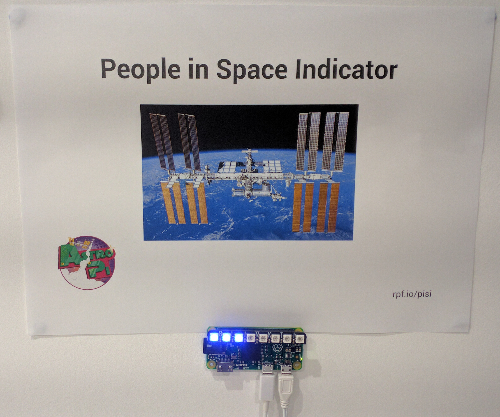

# People in Space Indicator with Blinkt

## Hardware

- Any 40-pin Raspberry Pi
- [Pimoroni Blinkt](https://shop.pimoroni.com/products/blinkt)

## Software

- [Pimoroni Blinkt Python library](https://github.com/pimoroni/blinkt)

## Setup

Run `pisi.py` on boot

## Features

Every minute, it grabs the [People In Space data](http://open-notify.org/Open-Notify-API/People-In-Space/) and lights up an LED per person in space, in sequence.

If network is unavailable, the end LED blinks red while it tries to reconnect.

## Notes

The API isn't updated quickly upon ISS departures and arrivals, as it's maintained by a single human.

There are usually 6 people on the ISS, and 3 come down before the next 3 go up. However it's possible 3 will arrive before 3 come down and there will be 9 and you'll be a LED short.

## Learning resource

This project is based on a Raspberry Pi learning resource I wrote that just uses simple LEDs using [GPIO Zero](http://gpiozero.readthedocs.io/). See [People in Space Indicator](https://www.raspberrypi.org/learning/people-in-space-indicator/).
